# Diplom-BD
Алгоритм развертывания:

| разертывание проекта | Linux Terminal                  | Windows Terminal                |
|----------------------|---------------------------------|---------------------------------|
|           1          |            cd Diplom-BD         |          cd Diplom-BD           |
|           2          |       python3 -m venv venv      |       python -m venv venv       |
|           3          |       docker compose build      |       docker compose build      |
|           4          |    sudo docker compose up -d    |       docker compose up -d      |
|           5          |     source venv/bin/activate    |   source venv/Scripts/activate  |
|           6          | pip install -r requirements.txt | pip install -r requirements.txt |
|           7          |            flask run            |            flask run            |

## Фото сайта

| 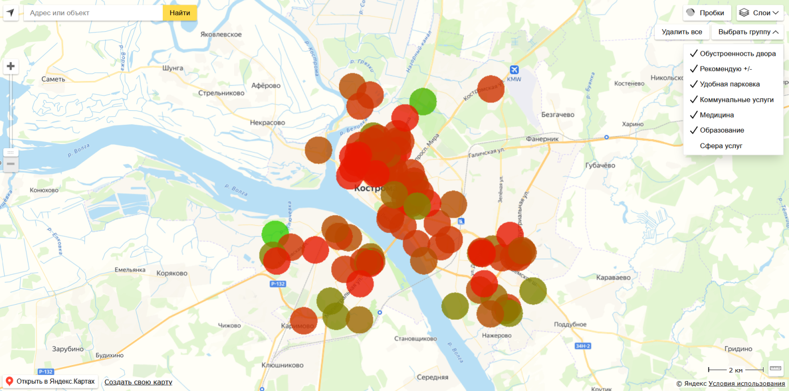 | 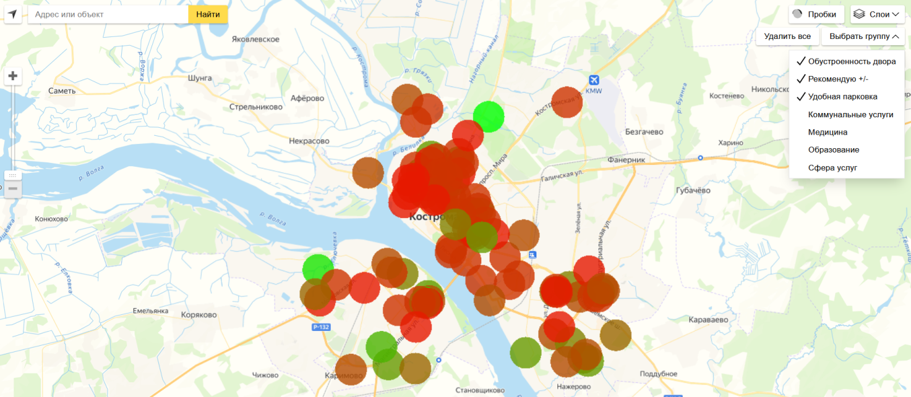 | 
|:-----------------------------------:|:-----------------------------------:|
| 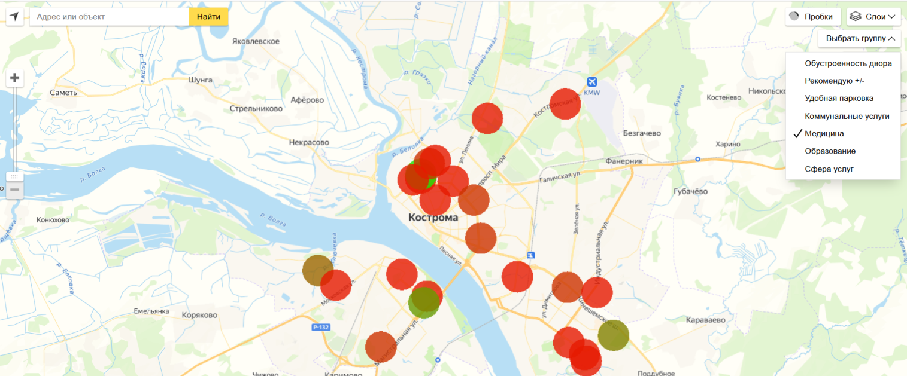 | 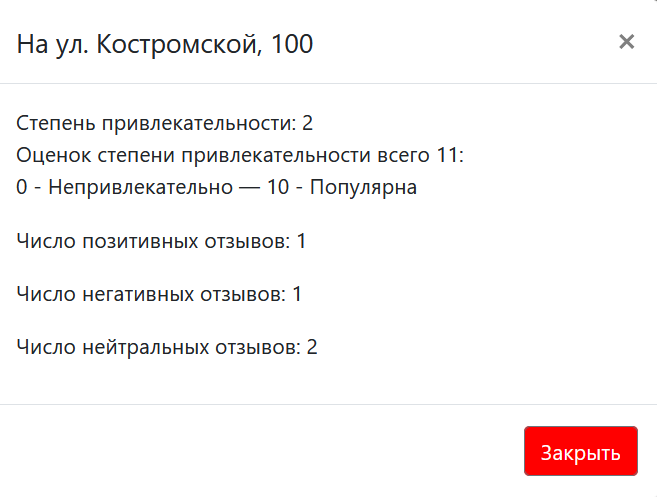 |
| 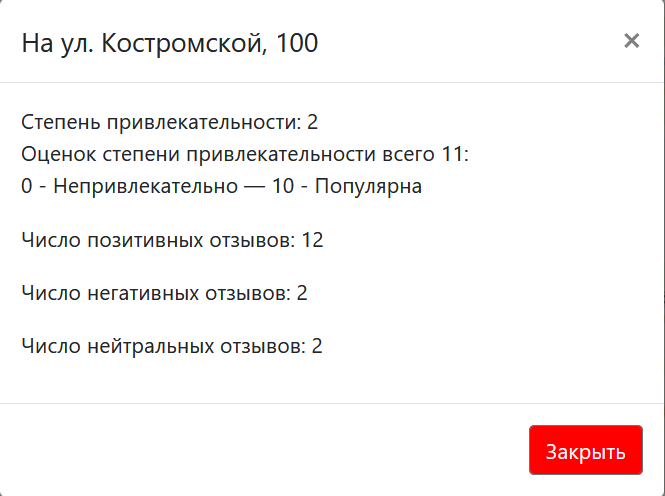 | 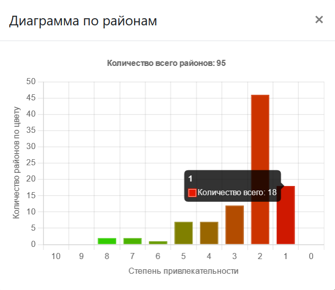 |
| 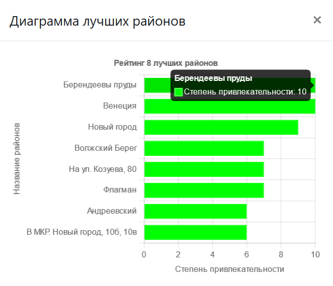 | 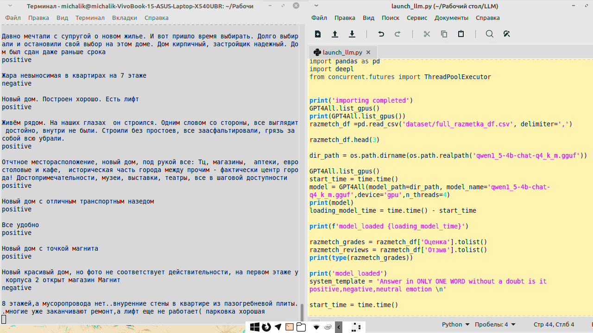 |
| 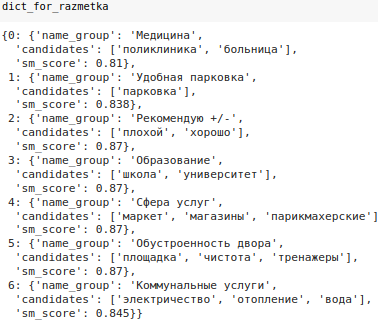 | 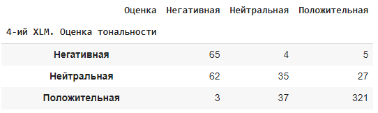 |
| 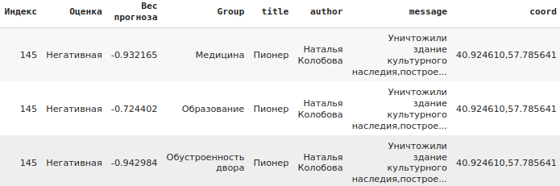 | 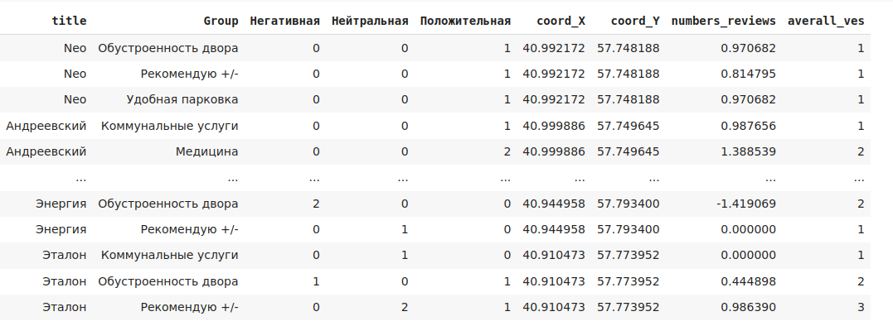 |
